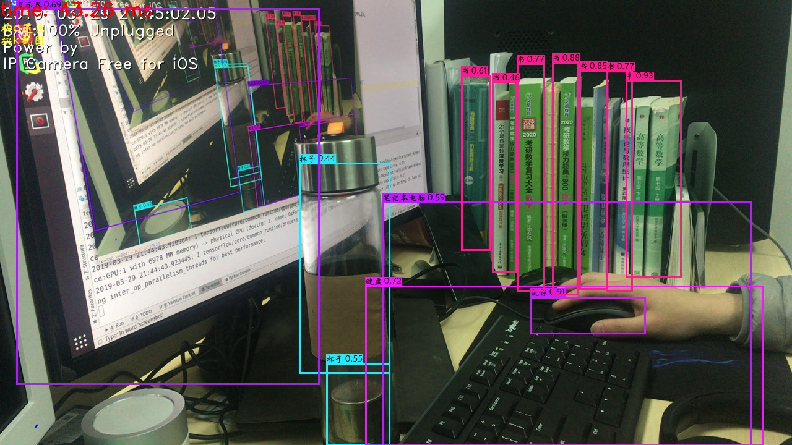
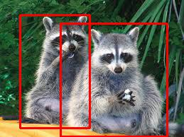
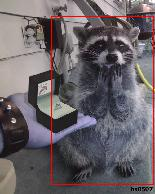

# 简介
本项目是对[yolov3的tensorflow实现](https://github.com/YunYang1994/tensorflow-yolov3)项目的"整合"吧,做了一些细微的修改,添加大量的中文注释,帮助进行快速阅读理解. 基础好的可以直接阅读原代码.

[yolov3的tensorflow实现](https://github.com/YunYang1994/tensorflow-yolov3)这个项目,应该是作为菜鸟的我到目前为止在原理和代码实现上最复杂的深度学习项目了. 项目代码量大,shape变换,维度广播,看着看着一不小心就迷失了,反反复复的看了好几遍,感觉才把整个项目代码的逻辑给拉通,整个过程反复调试,计算维度变换,运算的处理过程,总之收获巨大.

欢迎交流,指出错误等.
# 开箱即用

下载[yolov3的tensorflow实现](https://github.com/YunYang1994/tensorflow-yolov3)中的模型[yolov3.weights](https://pan.baidu.com/s/1qAlZcbw0hB7c38ybKkbYUw)，提取码：'dh94'放到`./data/checkpoint`中

运行
```
$ python convert_weight.py 
$ python video_dome.py # 默认使用0摄像头, 也可以通过局域网调用手机摄像头
```

# 学习

通过快速训练[quick_train.py]()开始,阅读项目代码开始学习yolov3的细节. 在之前
- 下载[raccoon](https://pan.baidu.com/s/1qAlZcbw0hB7c38ybKkbYUw)，提取码：'dh94',使用浣熊数据集



- [pic_vis.py](./train_demo/pic_visu.py) 可视化数据
- 使用[core.convert_tfrecord.py](./core/convert_tfrecord.py),转换为tfrecord文件
- [show_image_from_tfrecord.py](./train_demo/show_image_from_tfrecord.py),检查文件是否正常
- [quick_train.py](./train_demo/quick_train.py)开始训练调试
- [show_train_result.py](./train_demo/show_image_from_tfrecord.py) 检测所训练的模型效果.

# 使用其他数据集进行训练
待更新....

>https://github.com/YunYang1994/tensorflow-yolov3


**OpenSourceAI**

欢迎有兴趣的朋友加入我们，一个喜欢开源、热爱AI的团队。

OpenSourceAI Org：
https://github.com/opensourceai

QQ Group:  [584399282](https://shang.qq.com/wpa/qunwpa?idkey=46b645557bb6e6f118e0f786daacf61bd353b68a7b1ccba71b4e85b6d1b75b31)


